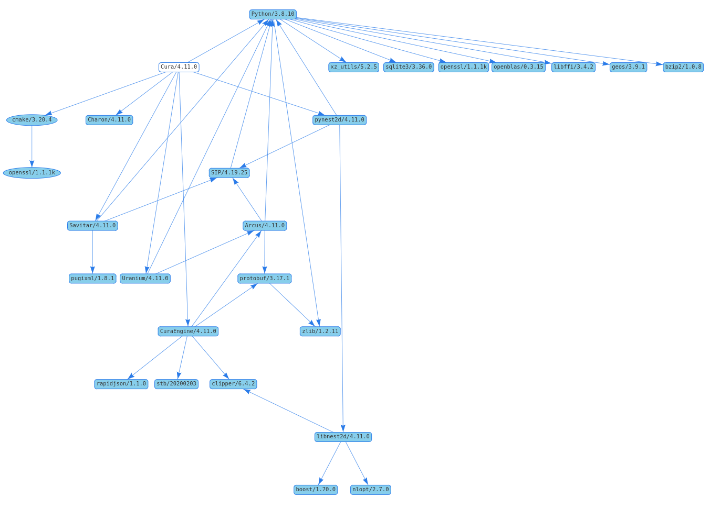

# Setting up a Cura source/build environment

> **DISCLAIMER!**  
> This method is unsupported by Ultimaker at the time and still subject to breaking changes.
> It uses a personal jFrog Artifactory repository on a home server if I see abuse services will be stopped and measures will be taken.

This is a personal Proof-Of-Concept how to setup a Cura source/build environment in such a way that it is easy, quick, system agnostic and reproducible. Using 
[Conan](https://conan.io/).

# Cura

Cura consists of a front-end ([Cura](https://github.com/Ultimaker/Cura)) and a back-end ([CuraEngine](https://github.com/Ultimaker/CuraEngine)).
CuraEngine is rewritten in C++ while Cura is written in Python but makes use of C++ libraries with [SIP 4.19.x](https://riverbankcomputing.com/software/sip/download) Pythonbinding.
These librabries have the following dependencies.


# Requirements

- Python 3.8 or higher. The Distributed version of Cura uses 3.8.10
- Pip
- Conan
  ```bash
  pip install conan --user
  ```
- git
- CMake 3.16 or higher
  
## Linux
GCC or Clang compiler with support for C++17

## MacOS
Clang compiler with support for C++17

## Windows
Visual Studio 2019 community edition (with support for C++17)

# Conan
Install Conan remote and Conan profiles from my repo
```bash
conan config install https://jellespijker/conan-config.git
```

# Setup the development environment

Create a development directory where you can install the Cura projects.

```bash
mkdir dev && cd dev
git clone http://github.com/ultimaker/Cura.git
cd Cura
python -m venv venv
```
On windows
```bash
venv/Scripts/activate.bat
```
On Linux and MacOS
```bash
source venv/bin/activate
```
Now you can install the python dependencies:
```bash
pip install numpy==1.20.2 scipy==1.6.2 shapely[vectorized]==1.7.1 appdirs==1.4.3 certifi==2019.11.28 cffi==1.14.1 chardet==3.0.4 cryptography==3.4.6 decorator==4.4.0 idna==2.8 importlib-metadata==3.7.2 netifaces==0.10.9 networkx==2.3 numpy-stl==2.10.1 packaging==18.0 pycollada==0.6 pycparser==2.19 pyparsing==2.4.2 PyQt5==5.15.4 pyserial==3.4 python-dateutil==2.8.0 python-utils==2.3.0 requests==2.22.0 sentry-sdk==0.13.5 six==1.12.0 trimesh==3.2.33 twisted==21.2.0 urllib3==1.25.8 zeroconf==0.31.0 keyring==23.0.1
```
Finally, use Conan to install the Ultimaker dependencies and create a Pycharm run configuration with the correct Paths
install the Cura dependencies. Make sure you specify the `-o *:python_version=3.8` you want to compile for.
```bash
mkdir .run
conan install Cura/4.10.0@ultimaker/testing -pr:b cura_release.jinja --pr:h cura_release.jinja -build=missing -o *:python_version=3.8 -g pycharm_run -if .run
```
